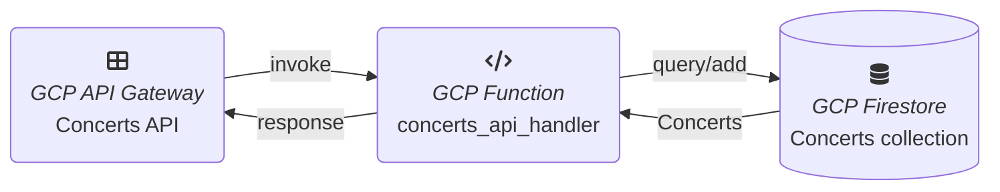
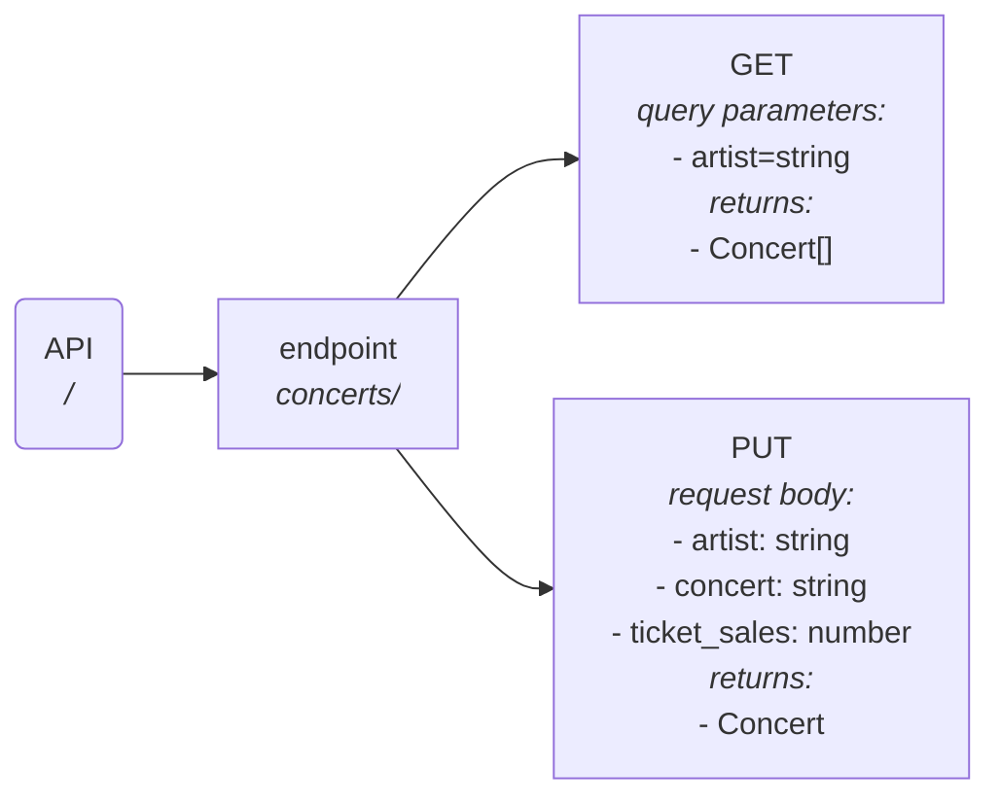
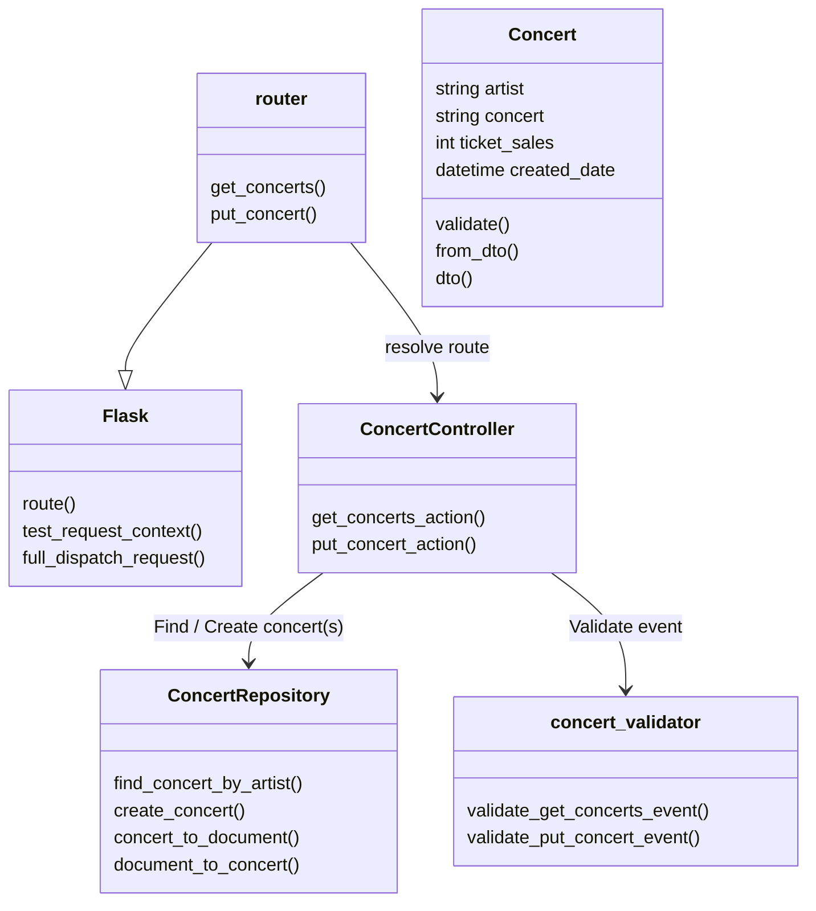
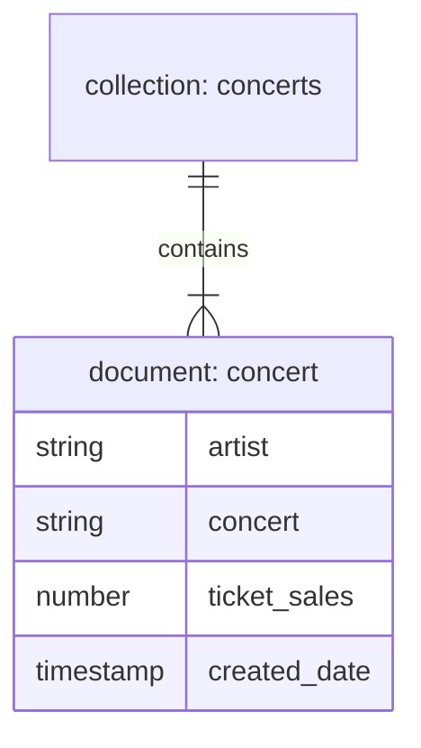

# Lab.GCP.API-Gateway

A basic API with API Gateway, Cloud Functions, Firestore and Terraform.

> **_NOTE:_**
> 
> GCP Deployment Manager is not developed very actively by Google.
> Important resources are missing, like for example API Gateway or Firestore.
> Other resources are not up-to date, e.g. Cloud Functions, which does not support yet V2.
> 
> On the other side Google is pushing Terraform.
> Therefore Terraform is used here instead of Deployment manager.

* [Google Cloud API Gateway](https://cloud.google.com/api-gateway)
* [Google Cloud Functions](https://cloud.google.com/functions)
* [Google Cloud Firestore](https://cloud.google.com/firestore)
* [Cloud Funcgtions Framework](https://cloud.google.com/functions/docs/functions-framework)
* [Terraform](https://www.terraform.io/)


## Architecture

<!-- Edit: https://mermaid.live/ -->


### API




### Handler



### Database




## Development

### Dependencies

1. Install latest gcloud CLI https://cloud.google.com/cli and setup with `gcloud init`
2. Install Terraform or OpenTofu:
   * Terraform https://developer.hashicorp.com/terraform/downloads (Install binary, if APT repository is not working)
   * OpenTofu https://github.com/opentofu/opentofu (Currently [01/10/2023] not yet stable enough)
3. Install Python 3.9


### Recommended Visual Studio Code plugins

* https://marketplace.visualstudio.com/items?itemName=redhat.vscode-yaml
* https://marketplace.visualstudio.com/items?itemName=yzhang.markdown-all-in-one
* https://marketplace.visualstudio.com/items?itemName=4ops.terraform


## Deployment

```sh
# Login to Google Cloud from terminal
gcloud auth application-default login

# Create a new gcloud project
gcloud projects create "concerts-2023"
gcloud config set project "concerts-2023"

# Enable services
gcloud services enable artifactregistry.googleapis.com cloudapis.googleapis.com cloudbuild.googleapis.com cloudfunctions.googleapis.com logging.googleapis.com monitoring.googleapis.com pubsub.googleapis.com run.googleapis.com storage-api.googleapis.com storage-component.googleapis.com storage.googleapis.com deploymentmanager.googleapis.com apigateway.googleapis.com firestore.googleapis.com servicecontrol.googleapis.com
```

### Terraform deployment

```sh
cd src
```

```sh
# Initialize Terraform project and download providers
terraform init

# Deploy resources with Terraform
terraform apply
```

> **_NOTE:_**
> 
> In this simple Terraform setup, the state file is created locally.
> For a production-ready setup, the state file should be synchronized to the cloud, e.g. the HashiCorp cloud or a Google Storage bucket.

### Cleanup

```sh
# Cleanup resources deployed with Terraform
terraform destroy
```

```sh
# Firestore is in beta phase and can only be deleted by CLI
gcloud alpha firestore databases delete --database="(default)"
```


## Test cases

* Create concert

        curl -X PUT --location 'https://concerts-api-gateway-dev-5pksjh0d.nw.gateway.dev/concerts'
            -H 'Content-Type: application/json'
            -d '{"artist":"Madonna","concert":"In time", "ticket_sales": 67280}'

* Empty PUT

        curl -X PUT --location 'https://concerts-api-gateway-dev-5pksjh0d.nw.gateway.dev/concerts'
            -H 'Content-Type: application/json'

* Missing PUT parameters

        curl -X PUT --location 'https://concerts-api-gateway-dev-5pksjh0d.nw.gateway.dev/concerts'
            -H 'Content-Type: application/json'
            -d '{"artist":"Madonna","concert":"This is Madonna 2023", "wrong_param": 500}'

* Invalid PUT parameters

        curl -X PUT --location 'https://concerts-api-gateway-dev-5pksjh0d.nw.gateway.dev/concerts'
            -H 'Content-Type: application/json'
            -d '{"artist":"Madonna","concert":"This is Madonna 2023", "ticket_sales": -5}'
* List concerts

        curl --location 'https://concerts-api-gateway-dev-5pksjh0d.nw.gateway.dev/concerts?artist=Madonna'

* Invalid list parameters

        curl --location 'https://concerts-api-gateway-dev-5pksjh0d.nw.gateway.dev/concerts?song_writer=Madonna'


## Resources

* [Create a 2nd gen Cloud Function by using the Google Cloud CLI](https://cloud.google.com/functions/docs/create-deploy-gcloud#functions_quickstart_helloworld-python)
* [How to use Google API Gateway with Cloud Run](https://medium.com/google-cloud/how-to-use-google-api-gateway-with-cloud-run-60698959b342)
* [API Gateway > Documentation > Passing data to and from the backend service](https://cloud.google.com/api-gateway/docs/passing-data)
* [Least privilege for Cloud Functions using Cloud IAM](https://cloud.google.com/blog/products/application-development/least-privilege-for-cloud-functions-using-cloud-iam)